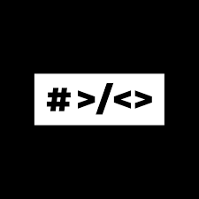

## :star: Descripción del proyecto

- Este repositorio contiene el proyecto correspondiente a una pagina web en la que se pueden compartir enlaces tipo foro online.

## :bookmark_tabs: Funcionalidades

- Para poder acceder a la pagina principal del proyecto es necesario logearnos en caso de tener cuenta previamente y en caso contrario registrarnos.
- Posteriormente accederemos a la Home de nuestra pagina principal donde tendremos acceso completo a esta. Teniendo la posibilidad de:
    1. Crear publicaciones para compartir con el resto de usuarios de la página.
    2. Votar publicaciones de otros usuarios, pudiendo darles una votación entre 0 y 5.
    3. Acceder a publiaciones especificas donde ademas de votar podremos comentarlas.
    4. Poder editar publicaciones propias creadas previamente.
    5. Eliminar publiaciones o comentarios propios.
    6. Acceder al perfil de cualquier usuario que haya realizado al menos una publicación. Donde podremos ver la información del usuario ademas de todas sus aportaciones a la pagina web.
    7. Editar nuestro perfil. Separando por un lado informacion sensible (contraseña), del resto de información.

## :hammer: Contruido con

### BackEnd

    1. NodeJS
    2. Express
    3. Cors
    4. Joi
    5. Jsonwebtoken
    6. morgan
    7. Mysql2
    8. Sharp

### FrontEnd

    1. React
    2. CSS
    3. Material UI
    4. Vite

## :electric_plug: Funcionamiento

- Al realizar el git clone del proyecto se deben seguir los siguientes pasos:

### BackEnd

~~~
// Acceder a la carpeta
cd BackEnd

// Crear base de datos
node db/initDB

//realizar instalación de dependencias
npm install

//Arrancar BackEnd
npm run dev
~~~

### FrontEnd

~~~
// Acceder a la carpeta
cd FrontEnd

//realizar instalación de dependencias
npm install

//Arrancar FrontEnd
npm run dev

//Acceder a la url en nuestro navegador
http://localhost:5173/login
~~~